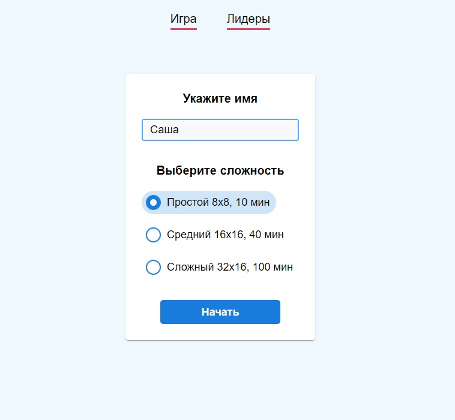
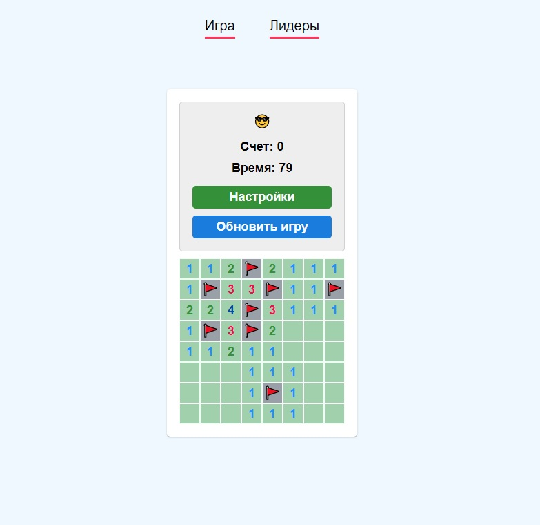
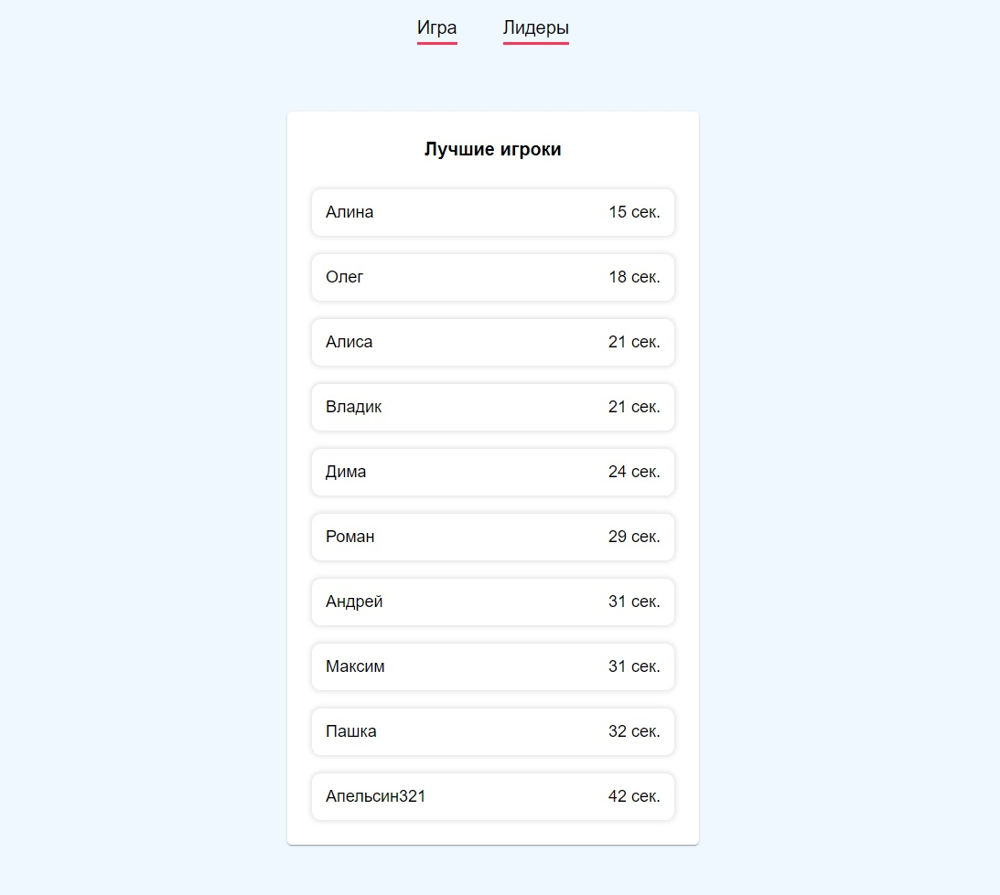

# Сапер на React

**О проекте:**
Реализация игры "Сапер" с выбором сложности и списком лидеров.<br>

**Цель игры:**
Найти все мины на игровом поле.<br>

**Режимы управления**<br>

- Левый клик - открытие ячейки.
- Правый клик - установка метки нахождения предполагаемой мины.<br>
  Доступные метки: Флажок, Вопросик (Меняются поочередно флажок - вопросик - ячейка без метки).

В игре доступно 3 уровня сложности, каждый меняет размер игрового поля:

- Простой - поле 8 * 8 клеток
- Средний - поле 16 * 16 клеток
- Сложный - поле 32 * 16 клеток
  <br>

Так-же доступен список лидеров, содержащий 10 игроков с лучшим временем решения головоломки.

## Изображения

### Начальный экран

 

### Игра

 

### Список лидеров

 

## Установка

```bash
git clone https://github.com/Krasivoe/minesweeper-react.git
cd minesweeper-react
npm install
```

## Сборка development

```bash
npm start
```

## Сборка production

```bash
npm run build
```
